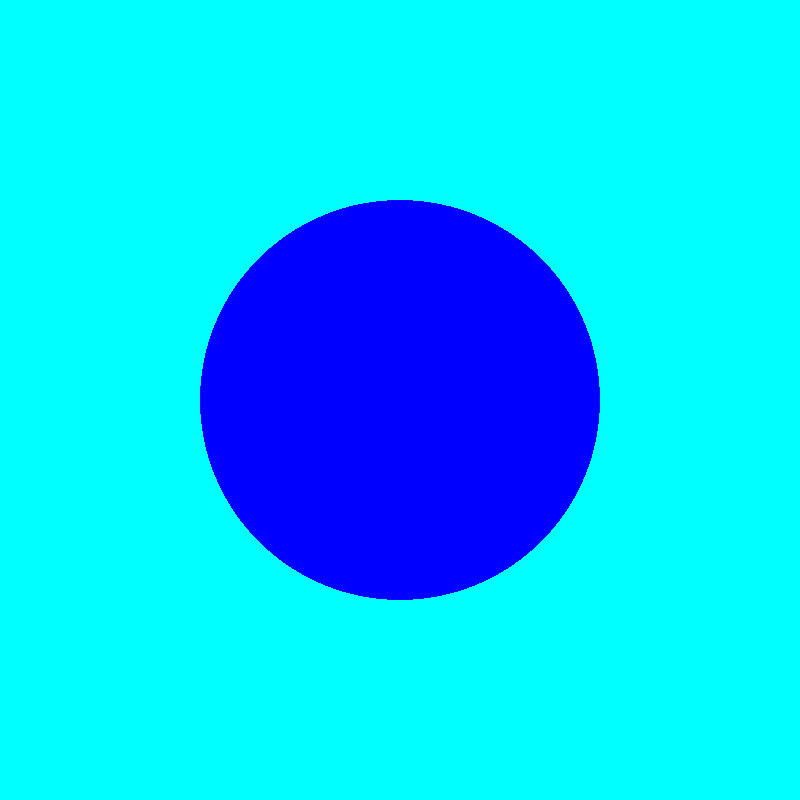

# hs-skia

Bindings to Google's Skia library through the C API of https://github.com/mono/skia

Working in progress!!

# Developer notes

## Demo

- If you already have `libSkiaSharp.so` built, do `cabal run skia:exe:demo-raster-example`.
- If you have `nix`, do `nix develop` build and install `libSkiaSharp.so` into
  the nix shell environment, then do `cabal run skia:exe:demo-raster-example`.

Running the demo should generate this PNG picture file:



## What is Skia and SkiaSharp
https://skia.org/: "Skia is an open source 2D graphics library which provides common APIs that work across a variety of hardware and software platforms. It serves as the graphics engine for Google Chrome and ChromeOS, Android, Flutter, and many other products."

Skia is [written in C++](https://github.com/google/skia). However, Haskell's FFI
does not mix well with C++
[apparently](https://www.reddit.com/r/haskell/comments/q2wwk1/do_you_use_ffi_to_bind_your_own_cc_function_in/).
To workaround this, a C API of Skia can be coded, then a Haskell skia binding
library can be bound to that C API. Google has [a C API of
Skia](https://chromium.googlesource.com/skia/+/master/experimental/c-api-example/c.md)
but it seems to be [not
well-maintained](https://news.ycombinator.com/item?id=39439035). Fortunately,
Microsoft provides [SkiaSharp](https://github.com/mono/SkiaSharp), a binding for
Skia for .NET platforms. Microsoft's SkiaSharp project forks Google's Skia and
implement their own C API of Skia [here](https://github.com/mono/skia). This
library is a Haskell binding library to that C API and it links to
`libSkiaSharp.so`.

## How to get Mono's Skia library

You have to build and install Mono's Skia library yourself. See
https://github.com/mono/SkiaSharp/wiki/Building-SkiaSharp.

This project provides `mono-skia-package.nix` to build and install Mono's Skia
library for developers to work on the Haskell library directly, though note that
this is a crude solution.

## How are the Haskell bindings made?

This project uses a Python script to parse Mono's Skia C API headers and
auto-generate almost all bindings. These generated Haskell bindings live in
`src/Skia/Bindings/AutoGenerated.hsc`. However, some C function bindings
require manual implementation, and they are handled in
`src/Skia/Bindings/Manual.hsc`.

## Future works

- Fix the binding generator's word breaker implementation. The binding
  generator's word breaker is an algorithm to break mangled C names like
  `gr_backendrendertarget_get_gl_framebufferinfo` into
  `gr/backend/render/target/get/gl/framebuffer/info` for use in generating nice
  camel case Haskell names like `grBackendRenderTargetGetGlFramebufferInfo`.
  However, the current implementation does not work perfectly.
- Auto-generate documentations.
- Create a high-level API like
  https://learn.microsoft.com/en-us/dotnet/api/skiasharp?view=skiasharp-2.88 +
  documentation.

## Miscellaneous notes

- Technically it should be possible to create our very own `cbits/` by copying
  all mono-skia C-API header/source files. However, some public Skia headers
  include internal private headers...
    - Here is a random example of a public Skia header including a private
      header: https://issues.skia.org/issues/40045022/blocking
    - `include/c/sk_document.h` includes some private headers.

- About module namespacing:
    - All modules in this library are prefixed with `Skia.`. Some may prefer `Graphics.Skia`, but it is less lean.
    - If there exists a different Haskell Skia binding library that also uses
the prefix `Skia.`, and for some reason someone's application depends on that
library and this one; a solution can be found here:
https://ghc.gitlab.haskell.org/ghc/doc/users_guide/exts/package_qualified_imports.html.

- Here is a list of odd facts about SkiaSharp/Mono Skia's C API found when this
library was being developed:

    - The enum value names of `sk_webpencoder_compression_t` are misspelled:
        ```
        typedef enum 
        {
        LOSSY_SK_WEBPENCODER_COMPTRESSION,
        LOSSLESS_SK_WEBPENCODER_COMPTRESSION
        } sk_webpencoder_compression_t
        ```

        - `sk_pixmap_get_writable_addr` is spelled properly, but
        `sk_pixmap_get_writeable_addr_with_xy` is not.

        - `sk_codec_get_frame_count` is implemented as 

        ```c
        int sk_codec_get_frame_count(sk_codec_t* codec) {
            return AsCodec(codec)->getFrameInfo().size();
        }
        ```

        ...which is very inefficient because it is getting an entire
        `std::vector` of FrameInfos to then only get `.size()` and discard.

        A better implementation should be (I think):

        ```c
        int sk_codec_get_frame_count(sk_codec_t* codec) {
            return AsCodec(codec)->getFrameCount();
        }
        ```

    - `sk_get_surface` should be named `sk_canvas_get_surface`.

    - `sk_get_recording_context` should be named `sk_canvas_get_recording_context`.

    - `sk_picture_recorder_end_recording` is missing an argument for `const SkRect&
    cullRect`.

    - `sk_picture_get_recording_canvas` should be named `sk_picture_recorder_get_recording_canvas`.

    - `sk_bitmap_get_pixels` probably should not be responsible for computing
    `size_t* length`. `sk_bitmap_get_byte_count` already provides an interface for
    this purpose.

    - `sk_surfaceprops_flags_t` should define `DYNAMIC_MSAA` and
      `ALWAYS_DITHER`.

    - `skottie_animation_seek_frame` and `skottie_animation_seek_frame_time`
      should take in `double` instead of `float` for parameter `t`.

    - `void sksg_invalidation_controller_begin(...)` and `void
      sksg_invalidation_controller_end(...)` are completely useless.
      `InvalidationController::begin()` and `InvalidationController::end()`
      return `std::vector::{cbegin,cend}` respectively, and Mono Skia's C binding
      simply voids them.

    - `sk_colorspace_to_xyzd50` always returns true, but this is due to how
      Google Skia designed the underlying C++ function.

    - `typedef struct sk_pixelref_factory_t sk_pixelref_factory_t;` is never used.

    - `typedef struct skottie_resource_provider_t skottie_resource_provider_t;`
      is actually `using ResourceProvider = skresources::ResourceProvider;`,
      which is defined by `typedef struct skresources_resource_provider_t
      skresources_resource_provider_t;`.

    - `skottie_animation_make_from_string` is the same as
      `skottie_animation_make_from_data`.

    - `sk_surface_draw` does not provide an interface to pass in an `SkSamplingOptions`.

    - `gr_direct_context_perform_deferred_cleanup` does not expose the parameter `opts`.

    - `sk_image_new_raster_copy` is redundant: Its function can be replaced by combining `sk_image_new_raster_copy_with_pixmap` and `sk_pixmap_new_with_params`

    - `sk_paint_get_blendmode` should not hardcode @SkBlendMode::kSrcOver@ as
      the default.

- Development process
    - The general process involves inspecting the C API and Skia C++ implementation in https://github.com/mono/skia. `clangd` can be set up (by manually applying the changes made in https://github.com/google/skia/commit/f5ea6a15bf936baae0248cb088b1b2b042706305#diff-7fc57714ef13c3325ce2a1130202edced92fcccc0c6db34a72f7b57f60d552a3 + running `bazel run //:gen_compile_flags_txt_linux_amd64 --config=ganesh_gl > compile_flags.txt` as recommended by the commit message) to help navigate around the C++ source.
    - https://github.com/mono/SkiaSharp is used as a reference of how a non-C++ library exposes the Skia API.

- Notes about `cbits/` and `cbits_make/`
    - NOTE: Without PCHs, compilation time is *really* slow because both clang++
      and g++ spend a lot of time on parsing files. Try add `-ftime-report` to
      CFLAGS to verify this claim.
    - Apparently PCHs are compiler-specific. The CLI of PCH operations are
      different from compiler to compiler (e.g., `gcc` vs `clang`). To deal with
      this, CMake is used instead of directly writing a Makefile. Additionally,
      as a bonus, CMake supports generating `compile_commands.json` for Clang.
    - Cabal compilg `cbits/` is very slow. Using PCHs can help. There are possible two solutions:
        1. Tell Cabal to create PCHs (somehow, but I don't think Cabal can do it).
        2. Externally compile with `cbits_make/`, which has a proper and
           efficient build system setup. However, I am not sure how to tell
           Cabal to do it.

- Google Skia's GN configs seem flawed. For example, `libskparagraph.so` built
  using the provided GN configs with flag `is_component_build=true` does not
  expose all symbols because `-fvisibility=hidden` is (erroneously?) applied to
  all shared library GN targets. To fix this, `skia-129-modified.nix` contains a
  patch to disable `-fvisibility=hidden`. Also see
  https://issues.skia.org/issues/358587937 ("skparagraph has no public symbols
  in component build")

- About `cbits/skia_capi/sk_types.h`: because of
  https://github.com/haskell/hsc2hs/issues/66 &
  https://gitlab.haskell.org/ghc/ghc/-/issues/23769, when this package is built
  as a dependency of an external application, `src/Skia/Bindings/Types.hsc` can
  read `cbits/skia_capi/sk_types.h` but is unable to resolve the `#include`
  directives within `cbits/skia_capi/sk_types.h` and complain that the
  referenced headers cannot be found. This means `sk_types.h` must contain *ALL*
  the type declarations, and you cannot separate the types into multiple header
  files to organize.